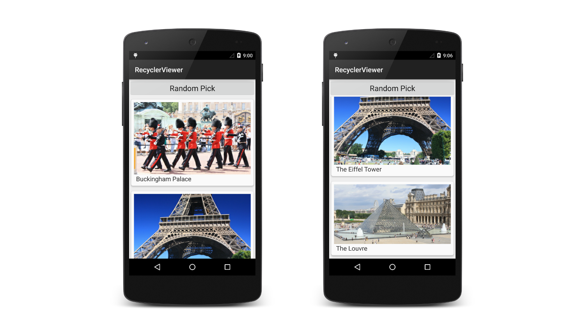

Android 5.0 RecyclerViewer
==========================

This sample app accompanies the articles
[CardView](http://developer.xamarin.com/guides/android/platform_features/android_l/cardview) and
[RecyclerView](http://developer.xamarin.com/guides/android/platform_features/android_l/recyclerview).
You can use this sample to learn how to use the new `RecyclerView` widget
introduced in Android 5.0 Lollipop.

This app is a simple "Photo Album Viewer" that lets the user scroll up and 
down to view a collection of photos. Each photo has associated title 
text that describes the photo. Each photo/title combination is 
displayed using a `CardView`, and the app uses a single `RecyclerView` 
instance to hold and display over thirty unique `CardView` instances. A 
basic *adapter* is used to connect the "Photo Album" data with the 
`RecyclerView`. 

Requirements
------------

To build and run this sample, you must first enable Android 5.0 support as 
described in 
[Setting Up an Android 5.0 Project](http://developer.xamarin.com/guides/android/platform_features/android_l/introduction_to_android_l#settingup).

You must also add the **Xamarin.Android.Support.v7.CardView** and 
**Xamarin.Android.Support.v7.RecyclerView** packages to the 
**RecyclerViewer** project as described next. 

To add these packages in Xamarin Studio:

1. Open the project, right-click Packages and select Add
   Packages.
2. In the Add Packages dialog, search for
   CardView.
3. Select Xamarin Support Library v7 CardView,
   then click Add Package.
4. In the Add Packages dialog, search for
   RecyclerView.
5. Select Xamarin Support Library v7 RecyclerView,
   then click Add Package.

To add these packages in Microsoft Visual Studio:

1. Open the project, right-click the References
   node (in the Solution Explorer
   pane) and select Manage NuGet Packages....
2. When the Manage NuGet Packages dialog is displayed,
   enter CardView in the search box.
3. When Xamarin Support Library v7 CardView
   appears, click Install.
4. In the Manage NuGet Packages dialog,
   enter RecyclerView in the search box.
5. When Xamarin Support Library v7 RecyclerView
   appears, click Install.

Author
------ 

Mark McLemore
